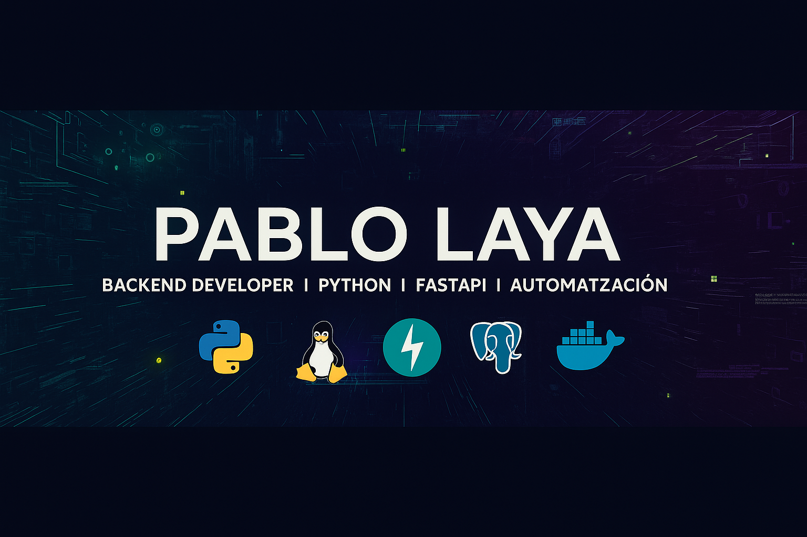

  

<h1 align="center" style="color:#F5F3FF;">👋 ¡Hola, soy Pablo Laya!</h1>

  <b>Desarrollador Backend en formación · Python · FastAPI · Automatización</b> 
  <i>Construyo sistemas backend eficientes, bots de Telegram y plataformas educativas con React + APIs modernas.</i>

---

### 🚀 Sobre mí

Soy estudiante del doble grado de **DAM + DAW** y del Master en Desarrollo con IA (Big School) en Madrid 🇪🇸 y estoy enfocado en dominar el desarrollo **backend con Python** y la **automatización de procesos**.

Actualmente profundizo en:

- 🐍 **Python backend** (FastAPI, Flask, asyncio)  
- ⚙️ **Diseño y documentación de APIs REST** con **Swagger/OpenAPI**  
- 🐘 **PostgreSQL** como base de datos relacional principal  
- 🧠 **Integración de IA** en proyectos reales y flujos de trabajo  
- 🤖 **Automatización y scraping web** (Playwright, BeautifulSoup)  
- 📨 **Telegram API** (bots funcionales y educativos)  
- 🐳 **Docker** para entornos reproducibles y despliegue  
- ⚛️ **React** para frontends funcionales, limpios y visualmente atractivos  

Mi meta profesional es convertirme en **Backend Developer especializado en Python**, con capacidad para diseñar soluciones integrales y escalables.

---

### 🧰 Tech Stack

  

- **Backend:** Python · FastAPI · Flask · SQLAlchemy  
- **Frontend:** React · TypeScript · HTML · CSS  
- **Base de datos:** PostgreSQL  
- **Infraestructura:** Docker · Railway · Ubuntu Server  
- **Automatización:** Playwright · BeautifulSoup · aiogram (Telegram API)  
- **Documentación:** Swagger · OpenAPI  

---

### 🧩 Proyectos Destacados

#### 🎓 Plataforma de Tests DAM/DAW
> Sistema **fullstack** de evaluación educativa con **modo práctica y examen**, estadísticas y ranking.  
> Frontend desarrollado con **React + TypeScript**, backend con **Node.js + Express**, y base de datos **PostgreSQL** mediante **Prisma ORM**.  
> Arquitectura modular y contenedorizada con **Docker**.  
> Actualmente cuenta con **más de 210 preguntas** del módulo DWEC y sigue ampliándose con nuevos tests de DAM/DAW.

#### 🎬 Bot de Carteleras 24/7  
> Bot de Telegram que obtiene la cartelera de cines mediante **scraping híbrido** (Playwright + TMDb API).  
> Desplegado 24/7 en **Docker** sobre Ubuntu Server.  
> Stack: Python · aiogram · Playwright · PostgreSQL.

#### 🧑‍🏫 Bot de Tests Educativos  
> Bot de Telegram para practicar exámenes de FP.  
> +6 meses en producción · ~50 usuarios activos concurrentes.  
> Stack: Python · aiogram · JSON DB · Heroku.

---

### 🧱 Filosofía de desarrollo

> “Automatiza lo repetitivo. Estructura lo complejo. Documenta lo invisible.”

Me motiva crear herramientas que **ahorren tiempo** y **trabajen solas**, con código claro, mantenible y documentado.  
Soy partidario del principio **KISS** (*Keep It Simple, Stupid*) y de diseñar proyectos que escalen con elegancia.

---

### 🎯 Objetivos actuales

- 🔥 Crear APIs profesionales con **FastAPI** y **PostgreSQL**  
- 🚀 Dominar **Docker** y **CI/CD** (Railway, GitHub Actions)  
- ⚛️ Mejorar la integración de **React** en proyectos personales  
- 🧠 Incorporar **IA** en bots y automatizaciones  

---

### 🌐 Conecta conmigo

  
  
  

---

### 📊 Estadísticas de GitHub

  <!-- Stats principal: habilita iconos y datos “extra” -->
  

  <!-- Streak: proyecto distinto -->

  

---

### 🧮 Lenguajes más usados

   

---

<i>“La automatización no reemplaza al desarrollador; lo libera.”</i>

